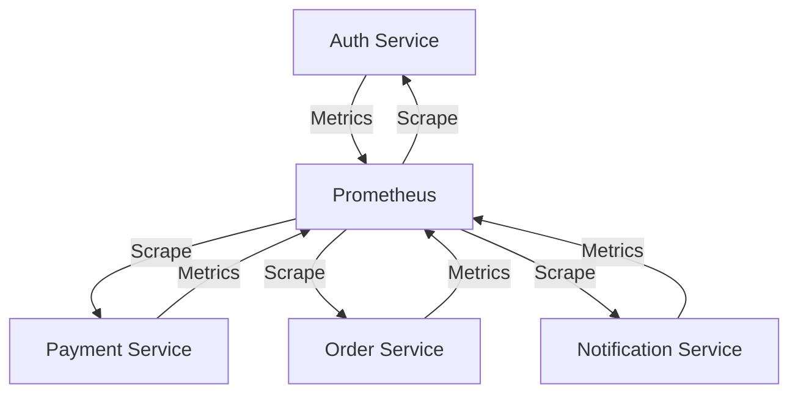

# go-micro-experiment

```bash
podman-compose up


## clean

podman-compose down
podman-compose delete
docker stop $(docker ps -a -q) 
docker rmi  $(docker images -q)
docker rm $(docker ps -a -q) -f
docker rmi  $(docker images -q)
```



```bash
docker ps
docker ps
Emulate Docker CLI using podman. Create /etc/containers/nodocker to quiet msg.
CONTAINER ID  IMAGE                                              COMMAND               CREATED         STATUS         PORTS                                                                                                                                                           NAMES
674fa7b6a530  localhost/go-micro-experiment_payment:latest       ./server              30 seconds ago  Up 20 seconds  0.0.0.0:8082->8082/tcp                                                                                                                                          go-micro-experiment_payment_1
5c8ad8c42e18  localhost/go-micro-experiment_order:latest         ./server              29 seconds ago  Up 19 seconds  0.0.0.0:8083->8083/tcp                                                                                                                                          go-micro-experiment_order_1
8f1251922b29  localhost/go-micro-experiment_notification:latest  ./server              28 seconds ago  Up 18 seconds  0.0.0.0:8084->8084/tcp                                                                                                                                          go-micro-experiment_notification_1
2644a74e1404  docker.io/prom/prometheus:latest                   --config.file=/et...  27 seconds ago  Up 17 seconds  0.0.0.0:9090->9090/tcp                                                                                                                                          go-micro-experiment_prometheus_1
73cda9a6f3e0  docker.io/jaegertracing/all-in-one:1.29                                  22 seconds ago  Up 16 seconds  0.0.0.0:5778->5778/tcp, 0.0.0.0:9411->9411/tcp, 0.0.0.0:14250->14250/tcp, 0.0.0.0:14268->14268/tcp, 0.0.0.0:16686->16686/tcp, 0.0.0.0:6831-6832->6831-6832/udp  go-micro-experiment_jaeger_1
b145f860f19d  localhost/go-micro-experiment_auth:latest          ./server              21 seconds ago  Up 15 seconds  0.0.0.0:8081->8081/tcp                                                                                                                                          go-micro-experiment_auth_1

```

# Todo
- [x] multi stage dockerfile
- [ ] add prom
- [ ] add open tracing